# Diagramas de Historias de Usuario

A continuación se presentan los diagramas (diagramas de secuencia y flujo) correspondientes a cada una de las Historias de Usuario (HU) descritas en el **Plan de Sprints** e **Historias Atomizadas**.

---

## Sprint 1: Bases, UI Inicial y CRUD

### HU-001: Visualización del Mapa de Mesas
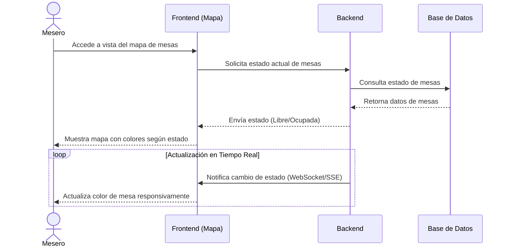

### HU-002: Apertura de Mesa
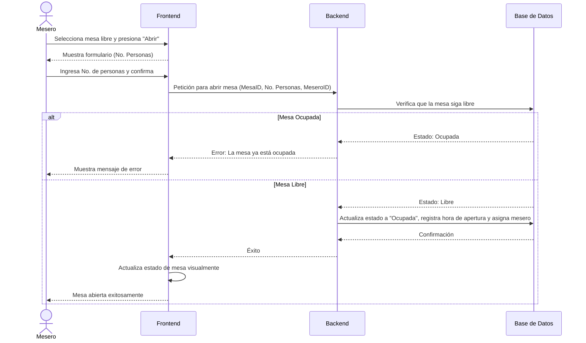

### HU-008: Gestión de Menú (CRUD)
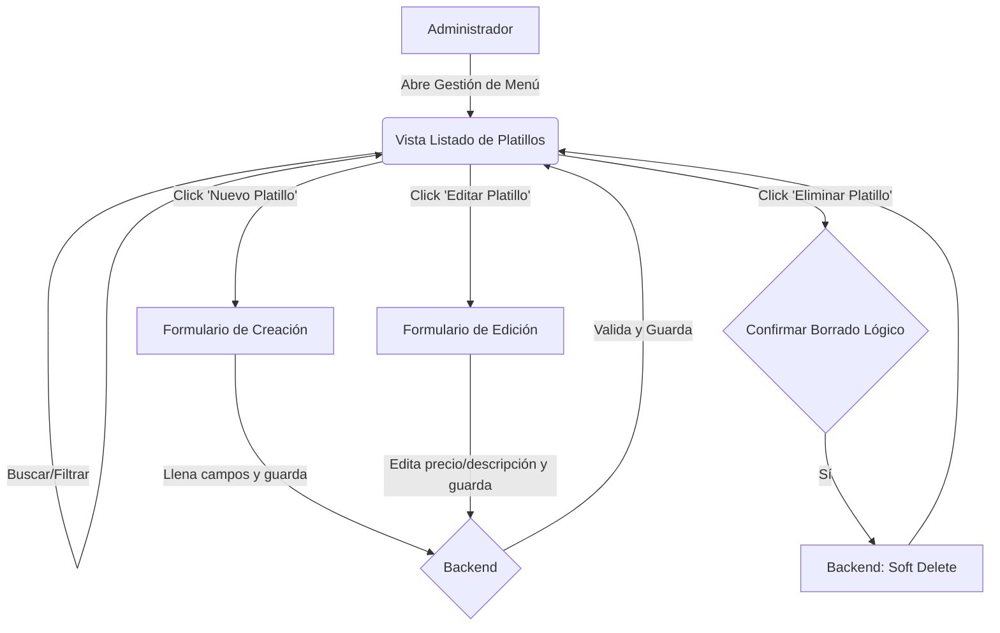

### HU-009: Receta de Platillos (Estructura y UI)
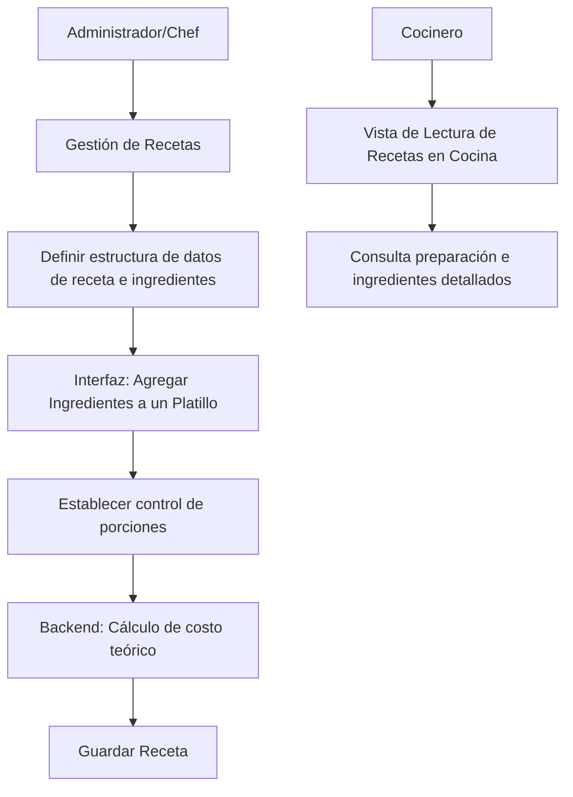

---

## Sprint 2 & 3: Lógica Backend, Toma de Pedidos, KDS

### HU-003: Toma de Pedidos (Comanda)
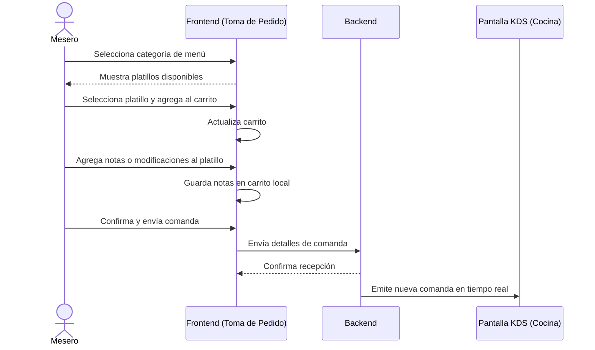

### HU-005: Pantalla de Recepción de Comandas (KDS)
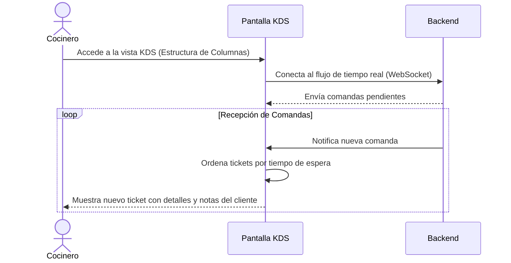

### HU-006: Actualización de Estado de Preparación
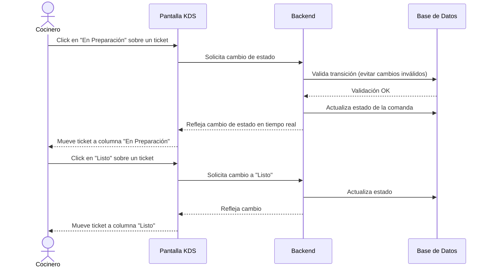

---

## Sprint 4 & 5: Cierre, Notificaciones e Inventario

### HU-004: Cierre de Cuenta y Pago
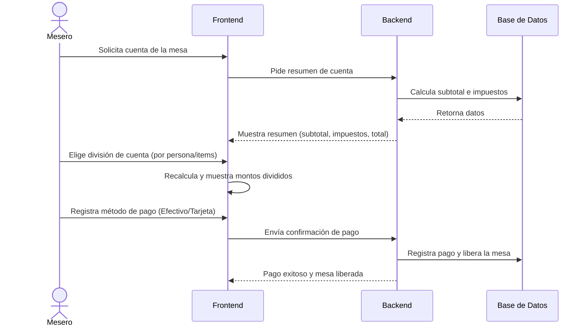

### HU-007: Notificación de Platillo Listo
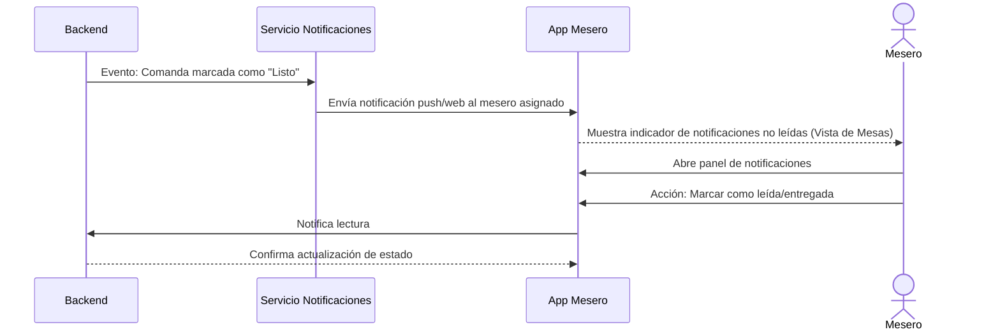

### HU-010: Descuento Automático de Inventario
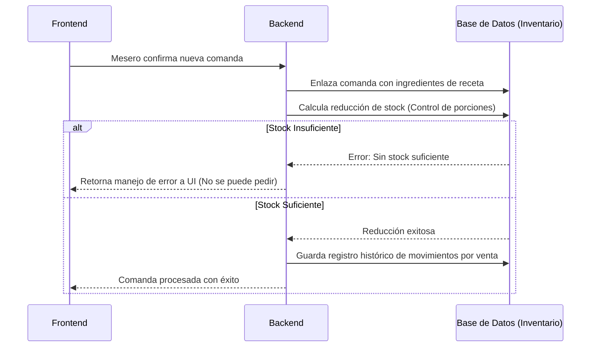

### HU-011: Alerta de Stock Mínimo
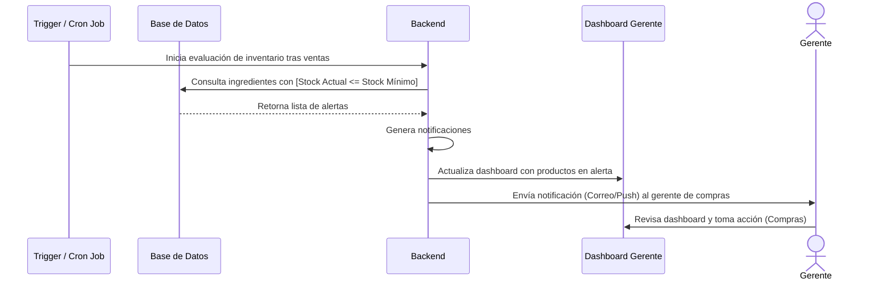
